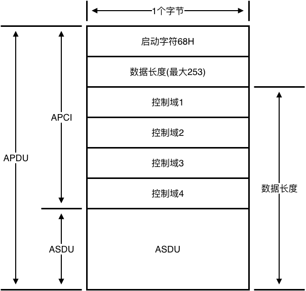
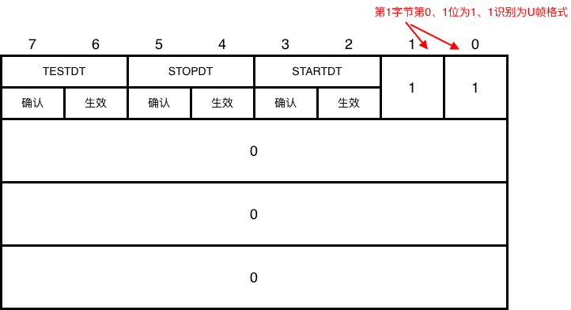
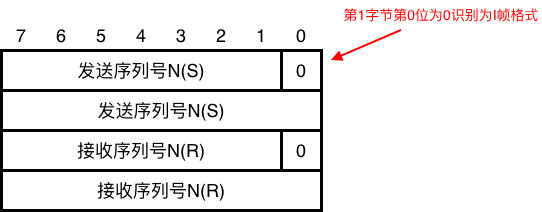
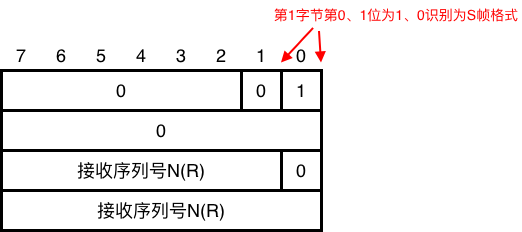
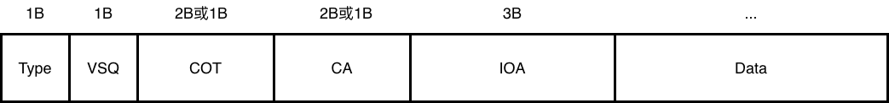
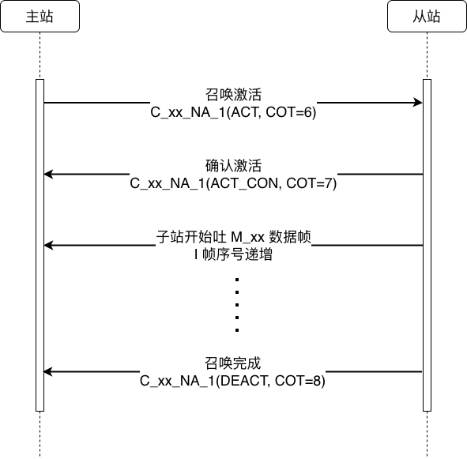

= IEC104学习笔记
:scripts: cjk
:toc: left
:toclevels: 3
:toc-title: 目录
:numbered:
:sectnums:
:sectnum-depth: 3
:source-highlighter: coderay

== 简介

IEC 60870-5-104 是一种基于串行通信的协议，用于在电力系统中传输数据。它的本质是：将串口时代的 IEC 101 应用层语义完整搬到 TCP/IP 上——保留成熟的 ASDU 数据结构、"四遥"数据模型，但传输层从 RS-232/485 换成以太网/TCP。

== 主站与子(从)站关系

. 主站为采集数据的设备，子(从)站为发送数据的设备
. 主站为 `client`，子(从)站为 `server`
. 主站负责发起通信，子(从)站负责响应通信

== APDU格式

* APDU：应用协议数据单元，完整一帧，总长度最大为 255 字节
* APCI：高级配置与电源接口，协议固定控制头，前 6 字节（0x68 + 数据长度 + 4 字节控制域）
* ASDU：应用服务数据单元，包含实际的数据，只有I格式时才有数据
* 数据长度: 数据长度为后面剩余的字节数 = APCI剩余(4B) + ASDU长度，最大 253 字节

== 帧格式

=== U 帧

* 链路控制（6字节，无ASDU）
* U帧控制域格式
+

* 命令列表
+
.命令列表
[cols="5,3,3",options="header"]
|===
|功能                         |    方向         | 完整报文（Hex）
|STARTDT act（启动数据传输·激活）|    主站 → 子站 | 68 04 07 00 00 00
|STARTDT con（启动确认）       |    子站 → 主站 | 68 04 0B 00 00 00
|STOPDT act（停止）           |    主站 → 子站 | 68 04 13 00 00 00
|STOPDT con（停止确认）        |    子站 → 主站 | 68 04 23 00 00 00
|TESTFR act（心跳测试·激活）    |    →          | 68 04 43 00 00 00
|TESTFR con（心跳确认）        |    ←          | 68 04 83 00 00 00
|===

=== I 帧

* 信息帧（携带 ASDU = 真正的数据）
* I帧控制域格式
+

** N(S): 发送序号，表示这次发送的I帧序号，首次为0，后面逐次 +1（实际编码值步进 +2）
** N( R): 接收序号，表示期待要接收的I帧序号，为已接收到的I帧序号+1，首次为0，表示还未收到任何消息，后面为实际接收到的I帧序号+1
** N(S)和N( R)序号范围 0 ~ 32767（15 bit），超过范围后会循环回 0
* 首次连接和重新连接后，N(S)和N( R)都将设置为 0

=== S 帧

* 确认帧（6字节，无ASDU）
* S帧在本身没有发送I帧时，用于确认接收到的I帧
* S帧控制域格式
+

== 关键参数

=== k

发送窗口大小: 发送方在未收到对方确认时，最多可连续发送的 I 帧数量(默认 `12`)

=== w

接收窗口大小: 接收方在收到 `w` 个 I 帧后，必须发送 S 帧进行确认(默认 `8`)

=== t0

TCP 连接超时(默认 `30s`)

=== t1

* 对方确认接收超时: 发送 `U/I` 帧后，如果超过 `t1` 时间，就断开连接(默认 `15s`)
* 每次发送 `U/I` 帧后，重新计时

=== t2

* 己方确认接收超时: 接收最后一条 `I` 帧超过 `t2` 时间后，才发送 `S` 帧进行确认(默认 `10s`)
* 当未超时又收到 I 帧，如果尚未到达 `w` 值时，重新计时；如果已达到，则发送 `S` 帧确认
* 已方的 `t2` 必须小于对方的 `t1`，否则还未确认对方就断开连接了

=== t3

* 空闲的超时时间: 如果未发送和接收任意 `U/I/S` 帧，超过 `t3` 时间就发送 `TESTFR act` 的 `U` 帧进行心跳测试(默认 `20s`)

== ASDU

=== ASDU格式

固定头有6~8字节

=== TI

* TypeID: 1 字节，值域 0–255，决定两件事：
** 后面每个信息对象的数据格式（几个字节、有没有品质描述词 QDS、有没有时标 CP56Time2a）
** 这包是"监视方向"还是"控制方向"
* 常用 TypeID 速查
+
[cols="1,2,3,2",options="header"]
|===
| TI  | 代号        | 含义              | 方向
|  1  | M_SP_NA_1  | 单点信息           | 子站→主站
|  13 | M_ME_NC_1  | 测量值，短浮点数     | 子站→主站
| 100 | C_IC_NA_1  | 总召唤             | 主站→子站
| 101 | C_CI_NA_1  | 电能脉冲(电度)召唤   | 主站→子站
| 103 | C_CS_NA_1  | 时钟同步           | 主站→子站
|===
* 命名规律
** M_开头 = Monitoring（监视，子站→主站）
** C_开头 = Control/Command（控制，主站→子站）
* _NA_1 / _NB_1 / _NC_1含义
** N = 标准定义（非厂商标配扩展）
** A/B/C = 数据编码方式（A=整数量化、B=标度化、C=IEEE754 浮点）
** _1 = 结构版本号（104 里基本全是 _1）

=== VSQ

* 可变结构限定词
* 1 字节，将 bit7 和 bit6~0 拆开
** bit6-0：本 ASDU 里信息对象的个数 N（0 保留，1–127 有效）。注意 127 是单 ASDU 上限
** bit7 = SQ（Sequence）
*** SQ=0：每个信息对象自带完整 IOA（3B） → IOA 可以不连续，灵活，国内主流用法
*** SQ=1：只有第一个信息对象带 IOA，后面 N-1 个对象的 IOA = 首 IOA + 1, +2 … 强制连续 → 省带宽，适合"一个间隔 32 个遥信连续排"的场景

[NOTE]
====
国内很多老装置 不支持 SQ=1，主站如果发了 SQ=1 的子站可能不认或直接丢。配点表时主站 VSQ 策略要跟子站对齐
====

=== COT

* 传送原因
* 长度 2B 或 1B（国内 104 几乎全是 2B：1B 原因 + 1B 源发站号/P/N/T 测试位）
* 低字节：原因码（Cause of Transmission）
+
[cols="2,3,4,2",options="header"]
|===
| 值 | 含义              | 备注                           | 方向
| 1  | 周期/循环         | 遥信变化自发上送                  | 子站→主站
| 2  | 背景扫描         | -                             |
| 3  | 突发(自发)        | 遥测变化自发上送                  | 子站→主站
| 4  | 初始化            | 装置重启后第一波                  |   
| 5  | 请求/被请求       | —                           |
| 6  | 激活             | 遥控/设点下发那一帧            |  主站→子站 
| 7  | 激活确认          | 子站回主站"我收到了，准备执行"   |  子站→主站
| 8  | 停止激活          | -                            |  主站→子站 
| 9  | 停止激活确认       | -                           |  子站→主站
| 10 | 激活终止          | —                           | 子站→主站
| 20 | 响应站召唤          | —                           | 子站→主站
| 21~36 | 响应 1~16 组召唤 | —                           |
| 37 | 响应计数量站召唤         | —                        |
| 38~41 | 响应 1~4 组计数量召唤 | —                        |
| 42~43 | 标准预留扩展（官方保留，禁止厂商私用）| —           | 
| 44 | 未知的类型标识       | —                           | —
| 45 | 未知的传送原因       | —                           | —
| 46 | 未知的 ASDU 公共地址 | —                           | —
| 47 | 未知的信息对象地址   | —                           | —
|===
* 高字节（第 2 字节）：T / P/N + 源发站号
** bit7 = T (Test 标志，1=测试报文，0=正常)
** bit6 = P/N (Positive/Negative，1=否定响应，0=肯定)
** bit0~5 = 源发站号 (Originator Address，0=主站自发)

=== CA

* Common Address of ASDU（ASDU 公共地址）
* 长度 2B 或 1B，全系统统一（国内电力 104 几乎全是 2 字节）
* 范围: 0 保留 / 1–65534 站址 / 65535(0xFFFF) 全局广播

=== IO

* 信息对象(Information Object)

==== IOA

* 信息对象地址(Information Object Address)
* 固定 3 字节，小端

==== Information Element

* 信息体元素，存储实际的业务数据
* 长度：可变。例如，单点遥信占 1 字节（0x00 或 0x01），短浮点遥测占 4 字节（IEEE 754 标准）

==== Time Tag

* 时标
* 长度: 通常为 7 字节（CP56Time2a 格式）或 2 字节（CP24Time2a 格式）
* 作用: 记录数据产生的精确时间（包含毫秒、分钟、小时、日期等），主要用于带时标的遥信（SOE）或事件记录

== 召唤流程

=== 基本流程

===  总召唤

* General Interrogation, GI
* ASDU 结构: Type=100 │ VSQ=1 │ CA=某站(或0xFFFF广播) │ COT=6(激活) │ IOA=0(固定) │ QOI=20
* QOI: 总召唤限定词，用于指定总召唤的范围和类型
+
[cols="1,5",options="header"]
|===
| 值  | 含义
| 0   | 不使用
| 20  | 全站总召唤（Station interrogation）- 最常用
| 21  | 组 1 召唤
| 22  | 组 2 召唤
| ... | ...
|===

=== 电度召唤

* QCC: 电度召唤限定词，共 1 字节，分为两个功能域
+
[cols="1,1,3,5",options="header"]
|===
| 位段            | 位数       | 名称               | 编码含义
.4+| D7~D6    .4+| 2 位    .4+| FRZ 冻结 / 复位模式 | 00：只读，不冻结不复位(实时读)|01：冻结不带复位（最常用）|10：冻结并复位计数器(不要用)|11：复位计数器(不要用)
.3+| D5~D0    .3+| 6 位    .3+| RQT 请求类型        | 1~4：第 1~4 组计数量分组召唤|5：全局计数量总召唤|0、6~31：保留 / 厂商专用
|===

== 几个工程坑

=== CA/COT 长度 是 1B 还是 2B 必须对齐

点表配的时候要看子站说明书，不是所有都回 COT=2

=== 总召回来的 COT 不是 2 是 20

有些厂家（尤其是南瑞系）把"总召响应"的 COT 用 20 而不是 2，这是 IEC 里"响应总召"的扩展码，点表配的时候要看子站说明书，不是所有都回 COT=2

=== TypeID 不在子站支持列表 → 静默丢弃

比如子站只实现了 Type=1/13/30/45/100，主站发了 Type=3（步位置），子站不回也不报错，现象就是"这点没数据"。配点前先看子站《104 数据点表》里的"支持 TypeID 清单"

=== 带时标的 Type（30/31/32…）比不带时标的多 7B 时标

SOE 用 Type=30 没错，但如果你遥信全用 Type=30 上送（而不是变位才带时标），带宽翻倍，老 101 专线会卡。正确做法：循环遥信用 Type=1，变位 SOE 用 Type=30

== 通讯过程

. TCP/IP连接建立
. 启动生效/确认
. 总召唤
. 时钟同步
. 变化数据上送
. 测试心跳
. 遥控
